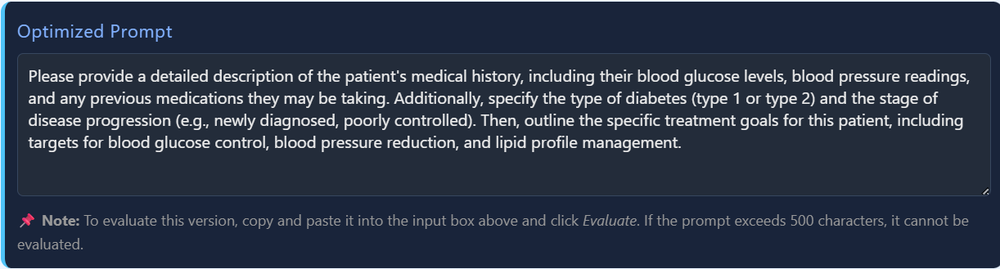

# 🧪 Medical Prompt Assistant

A web tool to evaluate and optimize medical prompts for Large Language Models (LLMs), with live scoring, visual feedback, and prompt history.  
Supports light/dark mode, interactive radar charts, and quick prompt improvement.

---

## 🚀 Features

- **Medical Prompt Evaluation:** Input a clinical prompt (max 500 chars) for scoring.
- **Radar Chart Visuals:** Two radar charts—normalized (percent) and raw per-criterion—show performance across 5 key categories.
- **Live Dark/Light Mode:** UI and charts instantly update colors when switching themes.
• Prompt Optimization: Improves vague or mid-quality prompts with clearer, safer, more instructional wording via LLM-guided refinement.
- **History List:** Stores last 10 prompts and their scores; quick click-to-load.
- **Responsive Mobile UI:** All components adapt for mobile and desktop.
- **Robust Error Handling:** Themed error cards and toasts for any failures.

---

## 🧠 Prompt Optimizer (Experimental)

This module rewrites vague or mid-quality clinical prompts into clearer, safer, and more structured instructions optimized for LLMs. It uses a local LLM (e.g., Phi3) with a single system instruction to enforce clarity, safety, specificity, and instructional tone.

### ⚙️ Current Behavior

- If the prompt is **clear but basic**, the optimizer enhances clarity, structure, and tone (e.g., score improved from 75 → 95).
- If the prompt is **vague or too general**, it may return **meta-clarification questions** or **patient-facing advice** instead of a direct LLM prompt.
- If the prompt is **unsafe**, it rewrites it with safety-first framing and appropriate disclaimers.
- Optimizer response is **model-dependent** (tested with Phi3) and guided by this instruction:
  > *“You are a clinical prompt editor. Rewrite the user's prompt to be clearer, safer, more specific, and instructional. Do not explain. Return ONLY the improved prompt, nothing else.”*

### 🧪 Prompt Optimization Test Summary

| Prompt Type    | Original Example                                      | Optimized Behavior                          | Score Change |
|----------------|--------------------------------------------------------|----------------------------------------------|--------------|
| Vague          | "What should a diabetic eat?"                          | Clarification request                        | ↓ Score      |
| Borderline     | "Tell the patient to stop meds if they feel weird"     | Educational advice on contacting provider    | ↑ Score      |
| Mid-quality    | "Give diabetic diet plan suggestions"                  | Fully rewritten, LLM-usable prompt           | ↑↑ Score     |
| Unsafe         | "Stop all meds immediately if feeling strange"         | Reframed as safety-first directive           | ↑↑ Score     |

### 🔒 Notes

- This feature is **fully functional and non-blocking** in MVP.
- Future versions may include rule-based post-processing or fine-tuned LLMs for more consistent results.

## 🖥️ UI Quick Guide

| Area             | Screenshot                                           | Description                                                                 |
|------------------|------------------------------------------------------|-----------------------------------------------------------------------------|
| Header           |                        | App name, dark/light mode toggle.                                           |
| Prompt Box       |                        | Enter medical prompt, see char count. Buttons: Evaluate, Optimize, Clear.  |
| Charts           |                        | Dual radar charts update after each evaluation.                            |
| Suggestions      |              | LLM suggestions and score breakdown.                                       |
| Error Card       |                         | Shown if prompt fails validation or backend error occurs.                  |
| History          |                       | Last 10 prompts, color-coded by score. Click to reload.                    |
| Optimized Prompt |              | Rewritten version of your prompt shown after clicking Optimize.           |

*Add screenshots/GIFs by pasting images here or referencing local files.*

---

## 🛠️ Usage Flow

1. **Input Prompt:** Type/paste your clinical prompt (max 500 chars).
2. **Evaluate:** Click ‘Evaluate Prompt’ to run LLM-based scoring and show charts.
3. **Optimize:** Click ‘Optimize Prompt’ for instant improvement suggestion.
4. **History:** Click any past prompt to reload and re-score.
5. **Switch Theme:** Toggle Dark Mode for night-friendly visuals.
6. **Clear/Example:** Quickly reset or load a template prompt for testing.

---

## ⚡ UI Component Notes

- **Charts:**  
  - Sizing and point label font scale dynamically (mobile/desktop).  
  - Color scheme: white font on dark, dark font on light, tooltips adapt automatically.
- **Toasts & Errors:**  
  - Appear at top for 4s; errors always match current theme.
- **Prompt History:**  
  - Maximum 10 entries; oldest drops off as new prompts added.
- **Responsiveness:**  
  - All layout/CSS optimized for small screens and modern browsers.

---

## 🔧 Developer Notes

- **Tech:** Vanilla JS, Chart.js, Flask backend.
- **Custom JS:**  
  - All UI state handled in `app.js` (charts, modals, dark mode).
  - Inline comments explain color/theme switching and chart resizing.
- **Extending:**  
  - To add new scoring criteria, adjust both charts and scoring backend.
  - All color/tone logic centralized at chart rendering.

---

## 🚨 Known Issues / TODO

- [ ] None outstanding as of latest update (all chart and theme bugs fixed).
- [ ] *(Add any new issues or future features here)*

---

## License

This project is licensed under the [MIT License](LICENSE).

---

## 👨‍💻 Maintainer

Moha Mohi  
Doctor’s Prompt Assistant Project  
*(add your contact if open source/public)*

---

